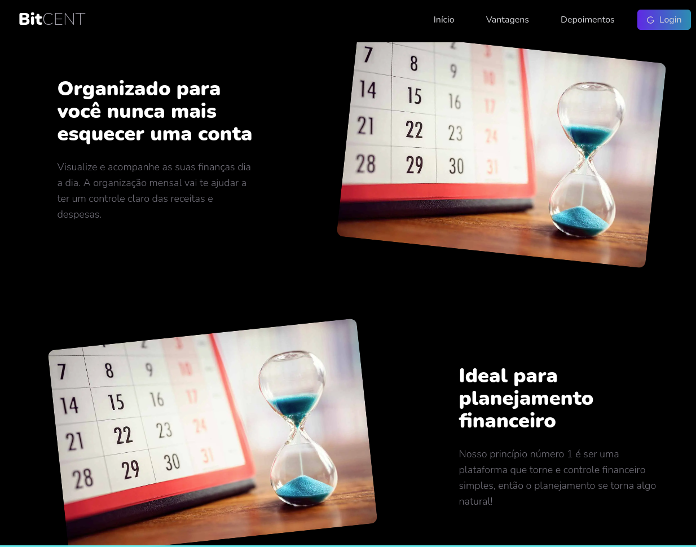
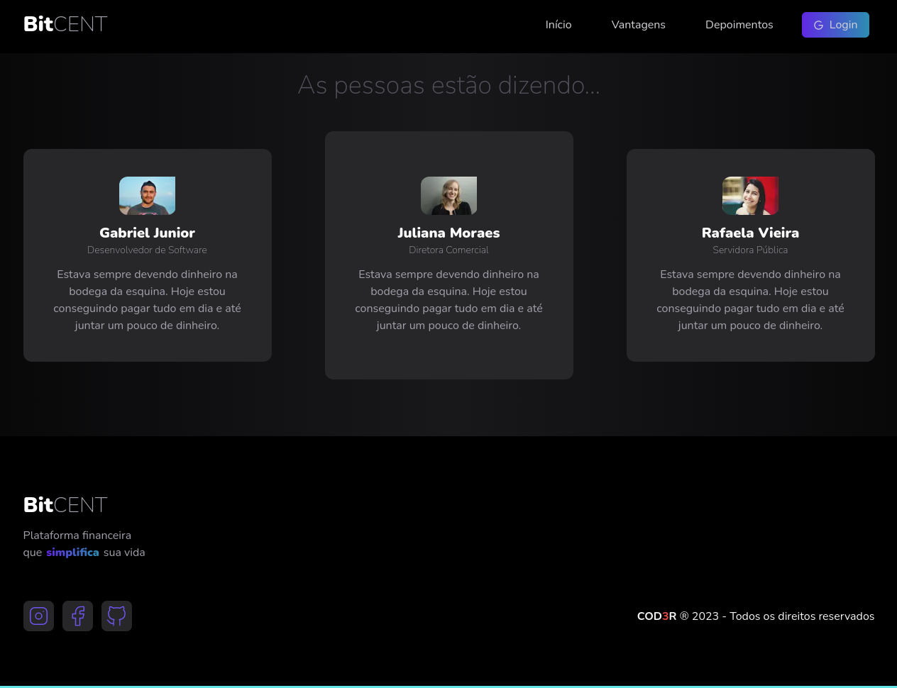
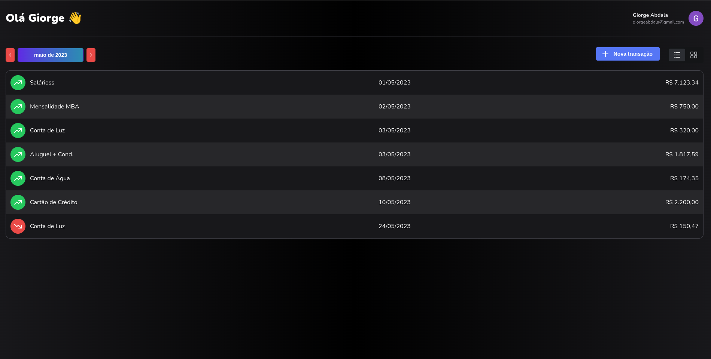
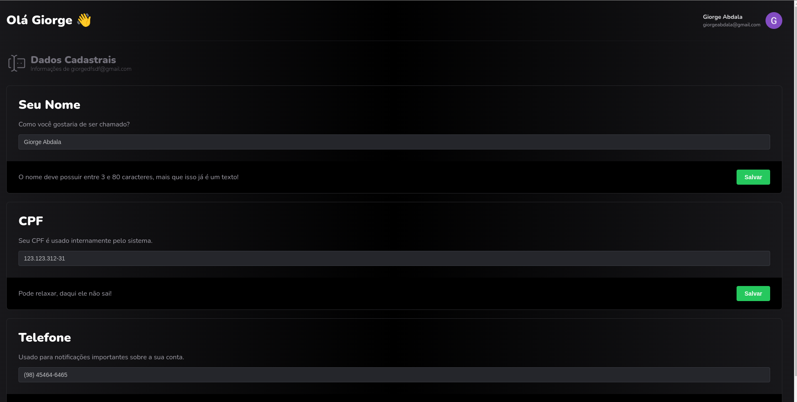

This is a study and learning project with React, typescript, next and Firebase.
It's a project presentation landing page and another app to control financial transactions, with different calendar and views. It also presents a screen for handling user data.
Authentication and backend is performed with firebase.
The app is 100% responsive.

## Getting Started

First, run the development server:

```bash
npm run dev

```

Open [http://localhost:3000](http://localhost:3000) with your browser to see the result.








